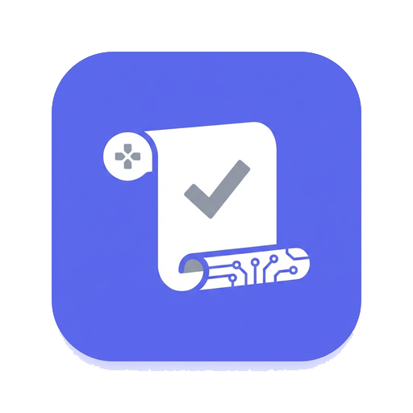

<div align="center">

# Discord Quest Helper

<p align="center">
  
</p>

**🎮 Automate your Discord Quests with one click**

Complete Discord video, stream, and game quests automatically while you focus on what matters.

⭐ **If you find this helpful, please give it a star!** ⭐

[](LICENSE)
[](https://github.com/Masterain98/discord-quest-helper/releases)
[](https://tauri.app/)
[](https://vuejs.org/)
[](https://www.rust-lang.org/)
[](https://github.com/Masterain98/discord-quest-helper/releases/latest)

</div>

## 🚀 Quick Start

> [!WARNING]
> **This tool is for educational purposes only.** Using this tool may violate Discord's Terms of Service. The authors are not responsible for any consequences resulting from the use of this software. Use at your own risk.

> [!IMPORTANT]
> This project uses GitHub Actions CI/CD workflows to build and publish its binaries as immutable releases, meaning the software you download is built directly from the original publicly available source code rather than manually uploaded binaries.
> You can use DeepWiki to ask questions about the project’s codebase. 
> [](https://deepwiki.com/Masterain98/discord-quest-helper)

### Download & Run

**Windows:**
1. Go to [GitHub Releases](https://github.com/Masterain98/discord-quest-helper/releases) and download:
   - **Portable**: `.zip` file — extract to any folder and run `discord-quest-helper.exe`
   - **Installer**: `.msi` file — double-click to install

**macOS (Apple Silicon):**
1. Go to [GitHub Releases](https://github.com/Masterain98/discord-quest-helper/releases) and download the latest `.dmg` file
2. Open the `.dmg` file and drag the app to your Applications folder
3. Run the following command in Terminal to remove the quarantine attribute:
   ```bash
   xattr -cr /Applications/Discord\ Quest\ Helper.app
   ```
4. Run `Discord Quest Helper` from Applications

### Login

1. Click **Auto Detect Token** for automatic extraction, or
2. Click **Manual Input** to enter your token directly

> [!NOTE]
> **Auto Detect Token** requires the Discord desktop client to be running in the background.

### Complete Quests

- **Video/Stream**: Click "Start Quest" on any incomplete quest
- **Game**: Use Game Simulator tab → Select game → Create & Run simulated game

## ✨ Features

- ⚡ **One-Click Login** — Automatically detects your Discord token, no scripts or technical steps needed
- 🎮 **Zero-Download Game Simulation** — Complete game quests without downloading or installing the actual game
- 📺 **Video & Stream Automation** — Click once, progress submits automatically in the background
- 🔍 **Advanced Quest Filter** — Filter by reward type, completion status, and more
- 👥 **Multi-Account Support** — Manage multiple Discord accounts seamlessly
- 🌏 **Multi-language** — 16 languages: English, Chinese (Simplified & Traditional), Japanese, Korean, Russian, Spanish, German, French, Indonesian, Polish, Portuguese (Brazil & Portugal), Thai, Turkish, Vietnamese

## 📸 Screenshots

| Login | Home |
|:-----:|:----:|
|  |  |

| Multi-Account | Game Simulator |
|:-------------:|:--------------:|
|  |  |

| Quest Progress | Settings |
|:--------------:|:--------:|
|  |  |

## 🏗️ Architecture

```
┌─────────────────────────────────────────────────────────────────┐
│                      Discord Quest Helper                        │
├─────────────────────────────────────────────────────────────────┤
│  Vue.js Frontend (Vite dev server :1420)                         │
│  ├─ Views: Home, GameSimulator, Settings, Debug                 │
│  ├─ Stores: auth.ts, quests.ts, version.ts, toast.ts (Pinia)    │
│  └─ API: tauri.ts (IPC bridge)                                   │
├────────────────────────┬────────────────────────────────────────┤
│     Tauri IPC          │                                         │
├────────────────────────┴────────────────────────────────────────┤
│  Rust Backend (Tauri 2)                                          │
│  ├─ token_extractor.rs   - LevelDB + DPAPI + AES-GCM             │
│  ├─ cdp_client.rs        - Chrome DevTools Protocol integration  │
│  ├─ cdp_quest.rs         - CDP-based quest completion            │
│  ├─ discord_api.rs       - HTTP client & endpoints               │
│  ├─ discord_gateway.rs   - WebSocket gateway connection          │
│  ├─ discord_cdp_launcher.rs - CDP launcher management            │
│  ├─ quest_completer.rs   - Video/stream automation               │
│  ├─ game_simulator.rs    - Process creation & management         │
│  ├─ super_properties.rs  - Discord client fingerprinting         │
│  ├─ stealth.rs           - Stealth mode for anti-detection       │
│  ├─ rpc.rs               - Discord RPC client                    │
│  ├─ runner.rs            - Activity runner parsing                │
│  ├─ logger.rs            - Structured logging                    │
│  └─ models.rs            - Data structures & types               │
├─────────────────────────────────────────────────────────────────┤
│  Game Runner (src-runner) - Minimal Windows exe (~140KB)         │
│  CDP Launcher (src-cdp-launcher) - Discord CDP sidecar binary   │
└─────────────────────────────────────────────────────────────────┘
                              │ HTTPS
                              ▼
                    Discord API (discord.com/api/v9)
```

## 🔒 Security

- **Tokens stored in memory only** — Never persisted to disk
- **HTTPS for all requests** — Secure API communication
- **Platform-native encryption** — Windows DPAPI / macOS Keychain

> [!CAUTION]
> Using automation tools may violate Discord ToS and result in account suspension.

## 🤝 Contributing

Contributions are welcome! Please see [CONTRIBUTING.md](CONTRIBUTING.md) for:

- Development setup
- Project structure
- Code conventions
- Pull request guidelines

## 📄 License

MIT License — see [LICENSE](LICENSE) file.


## 🙏 Credits

**Inspiration & Resources**
- [markterence/discord-quest-completer](https://github.com/markterence/discord-quest-completer)
- [power0matin/discord-quest-auto-completer](https://github.com/power0matin/discord-quest-auto-completer)
- [taisrisk/Discord-Quest-Helper](https://github.com/taisrisk/Discord-Quest-Helper)
- [aamiaa/CompleteDiscordQuest.md](https://gist.github.com/aamiaa/204cd9d42013ded9faf646fae7f89fbb)
- [docs.discord.food](https://docs.discord.food/)

**Technologies**
- [Tauri](https://tauri.app/) • [Vue.js](https://vuejs.org/) • [Pinia](https://pinia.vuejs.org/) • [vue-i18n](https://vue-i18n.intlify.dev/) • [shadcn-vue](https://www.shadcn-vue.com/) • [TailwindCSS](https://tailwindcss.com/) • [Lucide Icons](https://lucide.dev/)
